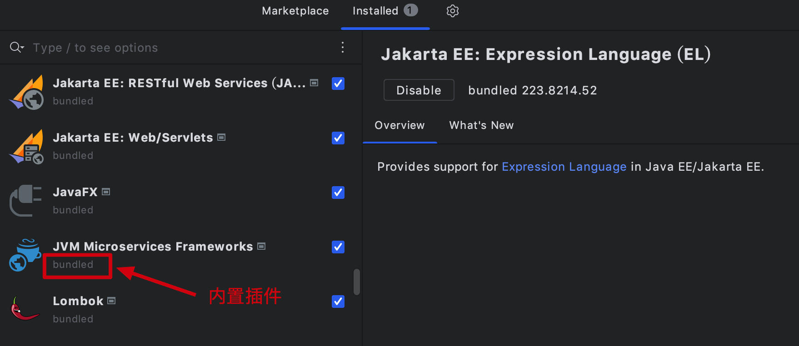
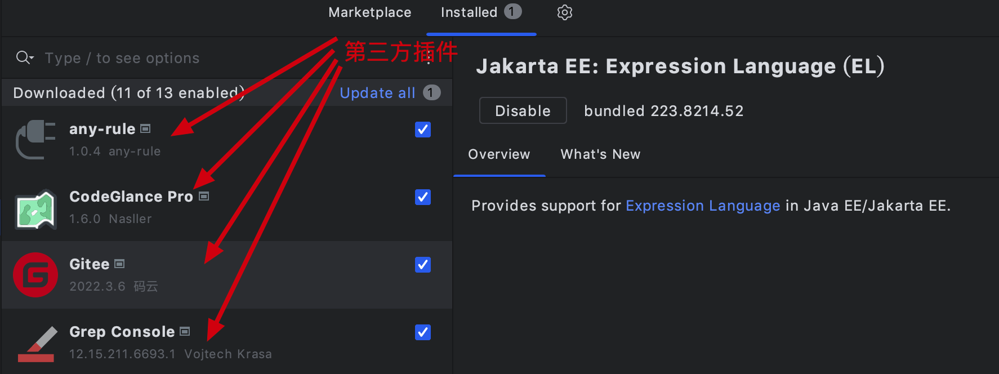

大家好，我是怪兽。

这次我们首先对`IDEA`插件开发有基本的认识，本节课不会涉及到任何的代码开发，文字和图片内容稍多一些，让大家首先认识一下`IDEA`中的插件。举个例子来说，如果你是做游戏开发的，尽管你不必精通这款游戏，但是你必须要知道游戏中用到的一些常用操作，这样当产品经理提出一个功能需求的时候，你最起码知道在哪里修改和优化代码。废话少说，接下来我们进入正题。

## IDEA插件是什么？

如果大家没有接触过`IDEA`插件，那么大家一定知道浏览器插件，通过浏览器插件我们可以扩展浏览器的功能，例如`AdGuard`浏览器插件里面拥有很多的广告过滤规则，通过安装该插件可以过滤掉很多知名网站的广告；又例如大名鼎鼎的油猴插件，该插件可以说是浏览器中的神兵利器，没有了它，就等同于没有了灵魂。

与浏览器插件类似，`IDEA`插件的作用就是用来扩展开发工具`IDEA`的功能，`IDEA`中的很多原生的功能都是通过插件来实现的，其插件分为内置插件和第三方插件，如下图：

内置插件：

第三方插件：

安装插件直接在`IDEA`开发工具的插件市场中搜索对应插件安装即可，除此之外，还可以在[官网](https://plugins.jetbrains.com/idea)下载对应的压缩包，通过本地进行安装。

>`IDEA`插件官网：https://plugins.jetbrains.com/idea

>`Jetbrains`官网：https://www.jetbrains.com/

## 为什么要学习IDEA插件开发？

既然`IDEA`的插件那么多，那么我们为什么还要学习`IDEA`插件开发呢？列举几个实际需求如下：

1、当前的插件不能满足特定工作的实际需求。

2、第三方插件的安全性和对数据隐私性的保护。

3、有些插件的功能很简单，但是需要付费。

4、频繁切换其他软件处理相关工作，效率低。

如果自己可以熟练的开发一个`IDEA`插件，那么你将有如下优势：

1、许多 `IntelliJ` 平台的 `IDE`都可以使用该插件，一次开发，处处使用，无需重复开发。

2、降低机械性且重复性的工作对于时间的浪费，大大提高工作效率。

3、一款良好的插件还可以给你带来经济收益。

`IDEA`工具官方在每次更新的时候，都会吸收一些优秀的第三方插件，例如我们所熟知的`Lombok`，在`2019`版本的`IDEA`中还是作为第三方插件来使用的，但是到了`2022`版本的`IDEA`中，已将将其作为`IDEA`官方内置插件了，如果你也有好的想法，你也完全可以做出像`Lombok`那样优秀的产品。

>Lombok官网：https://projectlombok.org/

在这里说明一下 `IntelliJ` 平台的 `IDE` 包含的产品都包括哪些，具体如下图所示：

与其说是`IDEA`插件开发，不如说是基于 `IntelliJ` 平台的 `IDE` 下的插件开发，因为开发的插件在该平台下的所有`IDE`中都可以使用。当然还有其他平台的插件开发，不过不在本文的讨论范围内，有兴趣的可以在[`Jetbrains`官网](https://www.jetbrains.com/)进行研究。

>`Jetbrains`官网：https://www.jetbrains.com/

## 开发插件需要的能力

1、丰富的产品想象力。比如爱因斯坦就说过：想象力比知识更重要，知识是有限的，而想象力却包含整个世界。如果你有很好的产品想象力，你也可以做出很优秀的产品。

2、`Java`开发经验。最起码要掌握最基本的`Java`语法知识和面向对象的知识，并且通过`Java`可以开发一个最基本的增删改查项目。

## 源码及文档下载

本教程的所有文档及源码可以关注微信公众号：码农怪兽，在公众号中回复关键字“IDEA插件开发”获取。