大家好，我是怪兽。

接下来我们开始程序员学技术中必不可缺的一环，即开发插件世界中的`HelloWrord`。开发之前，首先明确几个前提条件：

1、安装`JDK8`及以上版本的开发环境。

2、安装`IDEA`开发工具。

3、安装`Gradle`依赖管理和构建工具。

## 开发环境

怪兽本人的开发环境具体如下：

1、`JDK`版本（`JDK17`）

```shell
# JDK版本
java version "17.0.5" 2022-10-18 LTS
Java(TM) SE Runtime Environment (build 17.0.5+9-LTS-191)
Java HotSpot(TM) 64-Bit Server VM (build 17.0.5+9-LTS-191, mixed mode, sharing)
```

2、`Gradle`版本（`Gradle7.6`）

```shell
# Gradle版本
------------------------------------------------------------
Gradle 7.6
------------------------------------------------------------

Build time:   2022-11-25 13:35:10 UTC
Revision:     daece9dbc5b79370cc8e4fd6fe4b2cd400e150a8

Kotlin:       1.7.10
Groovy:       3.0.13
Ant:          Apache Ant(TM) version 1.10.11 compiled on July 10 2021
JVM:          17.0.5 (Oracle Corporation 17.0.5+9-LTS-191)
OS:           Mac OS X 10.14.6 x86_64
```

3、`IDEA`开发工具版本（`2022.3`专业版）

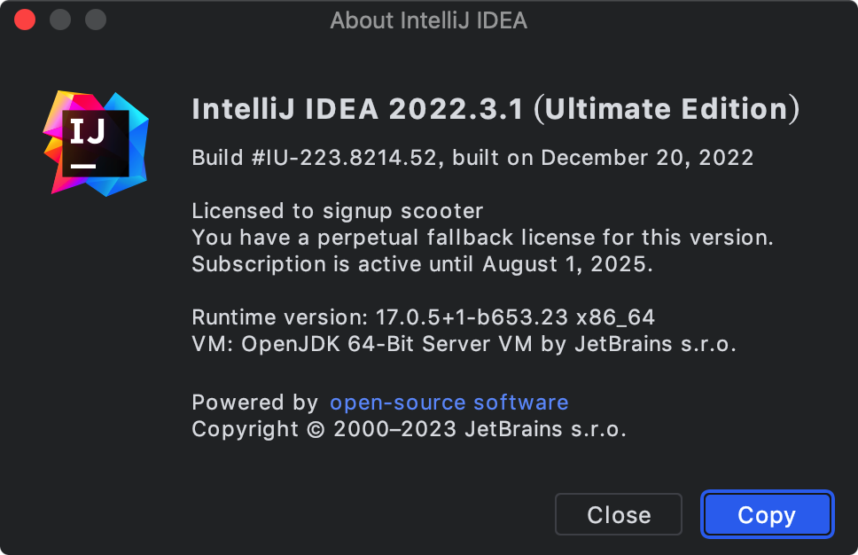

>相关命令：
>
>```shell
># 查看JDK版本信息
>java -version
># 查看Gradle版本信息
>gradle --version
>```

## 项目创建

得益于`IDEA`强大的功能使得我们创建一个`IDEA`插件项目变得非常简单，首先我们需要打开项目管理界面，新建一个项目：

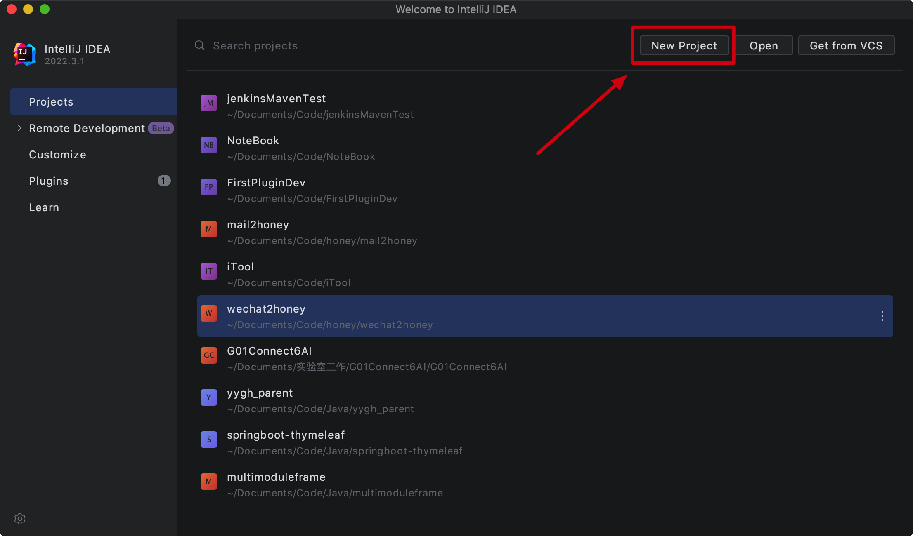

点击`IDE Plugin`可以填写插件项目的相关信息，项目名称填写`hello-world-plugin`，修改项目本地所在位置，选中新建项目类型为`Plugin`，使用语言为`Java`语言，同时填写`Group`信息和选择`JDK`版本，然后点击`Create`进行项目的创建。


项目在创建过程中，会下载插件项目对应的依赖插件，主要包括两个：`java`和`org.jetbrains.intellij`，具体内容可以在项目路径下的`build.gradle.kts`文件中的`plugins`标签中查看。初始项目构建完成之后出现如下提示代表创建项目成功。

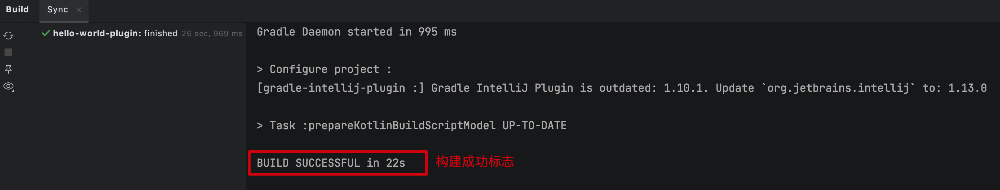

项目创建成功之后，我们打开`IDEA`应用偏好设置，修改一下项目的编译版本信息。

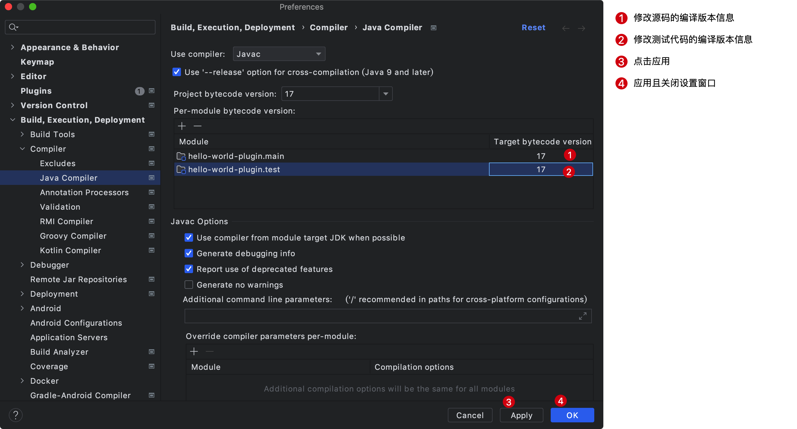

既然插件项目已经创建成功，那么我们接下来看一下项目的文件目录结构，了解各个目录的用处。


>`Gradle Wrapper`解决了什么问题？
>
>1、你本地安装的`Gradle`版本跟项目所需的`Gradle`版本不一致容易导致问题，为了解决该问题，`Gradle Wrapper`应运而生，`Gradle Wrapper`是一个脚本，可调用`Gradle`的声明版本，并在编译时下载。因此，开发人员可以快速启动并运行`Gradle`项目，而无需遵循手动安装`Gradle`过程。
>
>2、使用项目根目录下的`gradlew`命令运行的`Gradle`版本是`Gradle Wrapper`中声明的`Gradle`版本，不是本地安装的`Gradle`版本。
>
>3、`gradle/wrapper/gradle-wrapper.jar`是实际下载对应`Gradle`版本的工具包。

下面我们看一下`build.gradle.kts`文件的具体内容：

```kotlin
// 项目依赖插件
plugins {
    id("java")
    id("org.jetbrains.intellij") version "1.10.1"
}
// 项目Group信息
group = "com.codermonster"
// 版本信息
version = "1.0-SNAPSHOT"
// 依赖下载仓库
repositories {
    mavenCentral()
}

// Configure Gradle IntelliJ Plugin
// Read more: https://plugins.jetbrains.com/docs/intellij/tools-gradle-intellij-plugin.html
intellij {
  // 运行插件的时候，启动的IDEA版本
    version.set("2022.1.4")
    type.set("IC") // Target IDE Platform

    plugins.set(listOf(/* Plugin Dependencies */))
}

tasks {
    // Set the JVM compatibility versions
    withType<JavaCompile> {
        sourceCompatibility = "11"
        targetCompatibility = "11"
    }

    patchPluginXml {
        sinceBuild.set("221")
        untilBuild.set("231.*")
    }

    signPlugin {
        certificateChain.set(System.getenv("CERTIFICATE_CHAIN"))
        privateKey.set(System.getenv("PRIVATE_KEY"))
        password.set(System.getenv("PRIVATE_KEY_PASSWORD"))
    }

    publishPlugin {
        token.set(System.getenv("PUBLISH_TOKEN"))
    }
}

```

我们继续来看一下`resources/META-INF/plugin.xml`文件的信息：

```xml
<!-- Plugin Configuration File. Read more: https://plugins.jetbrains.com/docs/intellij/plugin-configuration-file.html -->
<idea-plugin>
    <!-- Unique identifier of the plugin. It should be FQN. It cannot be changed between the plugin versions. -->
    <id>com.codermonster.hello-world-plugin</id>

    <!-- Public plugin name should be written in Title Case.
         Guidelines: https://plugins.jetbrains.com/docs/marketplace/plugin-overview-page.html#plugin-name -->
  <!-- 运行插件项目显示的插件名称 -->
    <name>Hello-world-plugin</name>

    <!-- A displayed Vendor name or Organization ID displayed on the Plugins Page. -->
    <!-- 联系信息 -->
    <vendor email="support@yourcompany.com" url="https://www.yourcompany.com">YourCompany</vendor>

    <!-- Description of the plugin displayed on the Plugin Page and IDE Plugin Manager.
         Simple HTML elements (text formatting, paragraphs, and lists) can be added inside of <![CDATA[ ]]> tag.
         Guidelines: https://plugins.jetbrains.com/docs/marketplace/plugin-overview-page.html#plugin-description -->
    <!-- 插件说明 -->
    <description><![CDATA[
    Enter short description for your plugin here.<br>
    <em>most HTML tags may be used</em>
  ]]></description>

    <!-- Product and plugin compatibility requirements.
         Read more: https://plugins.jetbrains.com/docs/intellij/plugin-compatibility.html -->
    <depends>com.intellij.modules.platform</depends>

    <!-- Extension points defined by the plugin.
         Read more: https://plugins.jetbrains.com/docs/intellij/plugin-extension-points.html -->
    <extensions defaultExtensionNs="com.intellij">

    </extensions>
</idea-plugin>
```

`Gradle Wrapper`的配置文件是`gradle/wrapper/gradle-wrapper.properties`，我们继续看一下该文件的信息：

```properties
# 解压Gradle压缩包之后的文件存放处
distributionBase=GRADLE_USER_HOME
# 解压Gradle压缩包之后的文件存放处，相对于distributionBase设置的路径基础之上的文件路径
distributionPath=wrapper/dists
# 下载地址
distributionUrl=https\://services.gradle.org/distributions/gradle-7.5.1-bin.zip
# Gradle压缩包文件存放处
zipStoreBase=GRADLE_USER_HOME
# Gradle压缩包文件存放处，相对于zipStoreBase设置的路径基础之上的文件路径
zipStorePath=wrapper/dists
```

至此，我们已经完成了一个插件项目的创建，在项目的右上方可以直接运行项目，点击运行之后，会在沙盒中新打开一个`IDEA`窗口。

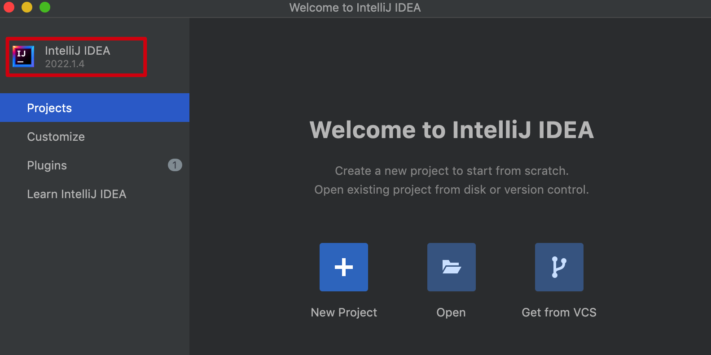

我们可以看到该`IDEA`窗口的版本信息和配置文件`build.gradle.kts`中规定的版本信息一致。除此之外，点击`Plugins`，可以看到新创建的插件已经被安装在新打开的`IDEA`中了。

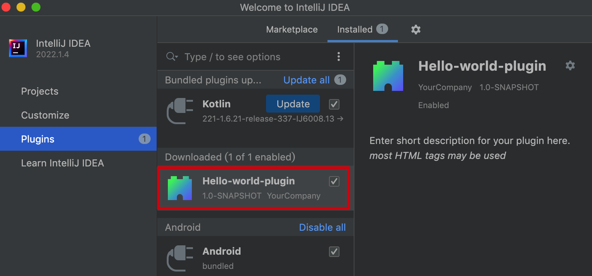

关闭新创建`IDEA`的窗口即可结束插件项目的运行。

## 运行项目的三种方式

按照上面的过程创建完插件项目之后，在`IDEA`界面的右上角会自动出现`Run Plugin`的按钮，点击即可运行，除此之外，还有其他两种运行插件的方式，总结三种运行插件项目的方式如下：

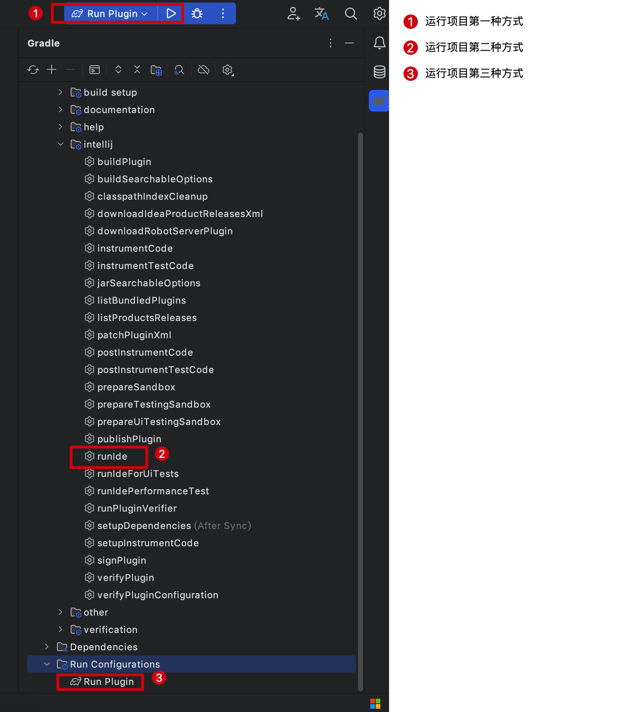

如果右上角没有出现`Run Plugin`的按钮，也可以自行配置，点击`Edit Configurations`。

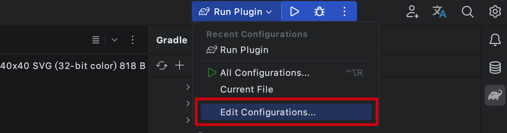

添加运行配置，输入运行名称和运行命令，直接应用即可。

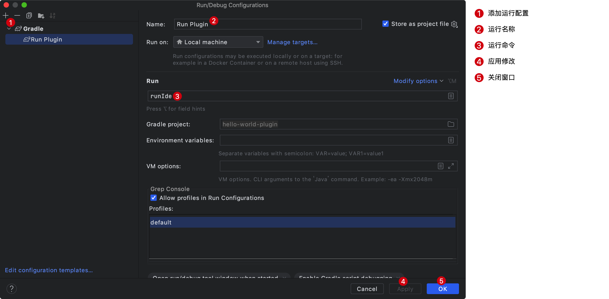

## 插件基础信息

插件的基础信息都可以在`resources/META-INF/plugin.xml`文件中进行配置，我们可以修改一下默认的配置信息：

```xml
<idea-plugin>
    <id>com.codermonster.hello-world-plugin</id>

    <!--    插件名称，不允许出现plugin字符串-->
    <name>Hello-World</name>
    <!--联系信息-->
    <vendor email="buaastys@163.com" url="https://codermonster.top/">码农怪兽</vendor>


    <!--    插件描述信息，少于40个字符IDEA可能会红色高亮提示，但是对插件的大包编译无影响。-->
    <description><![CDATA[
        <h2>HelloWordPlugin</h2>
        <p>路漫漫其修远兮，吾将上下而求索。</p><br>
        <p>穷则独善其身，达则兼济天下。</p><br>
        <p>人生自古谁无死，留取丹心照汗青。</p><br>
        <p>我们是国家的主人，应该处处为国家着想。</p><br>
  ]]></description>

    <depends>com.intellij.modules.platform</depends>

    <extensions defaultExtensionNs="com.intellij">

    </extensions>
    <!--    插件更新日志-->
    <change-notes>
        <![CDATA[
      1.0.0 项目初始化<br>
      1.0.1 搭建项目框架
        ]]>
    </change-notes>
</idea-plugin>
```

重新运行项目，可以看到如下的显示信息：

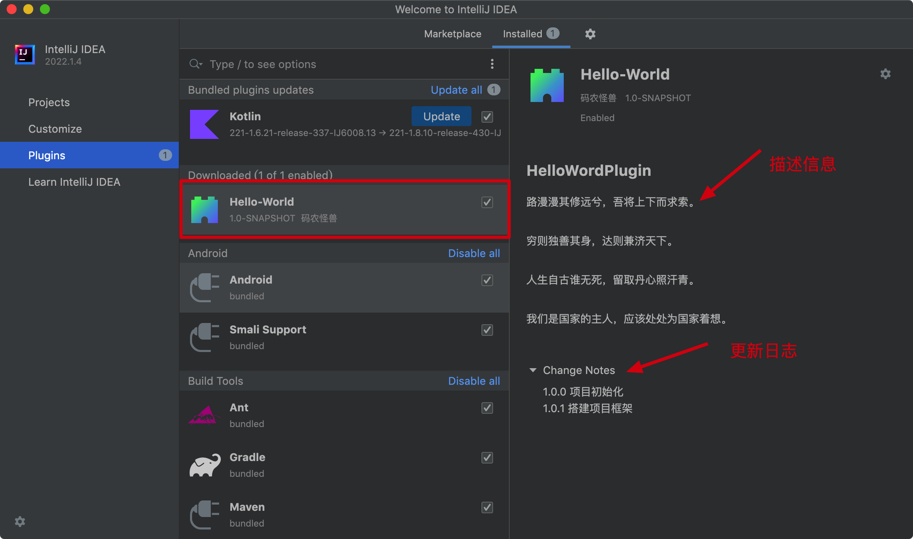

## 增加功能Action

`Action` 是插件开发中核心的一个概念，`Action` 可以理解为插件中某个功能的具体实现，举个例子，`IDEA` 中，默认通过快捷键 `Command+Option+L` ，来对代码文件进行格式 `Format` 。又比如，我们在 `IDE` 中，点击鼠标右键，会弹出一个功能菜单，这个菜单中的每一个选项，都对应着一个具体的功能操作，这个功能操作所做的事情，也是一个 `Action` 在代码中所做的事情。

调用插件中的功能，最常见方式就是基于 `Action` 来实现的，`Antion` 代表一个具体的功能动作。`Action` 可通过快捷键、菜单选项来触发。

使用`Action`的方式是通过一个实现类继承`AnAction`抽象类，实现其中的`actionPerformed`方法，在该方法中定义功能逻辑，即当快捷键或者菜单选项触发时，会执行方法中的内容。

定义一个实现类`HelloWorldAction`，代码如下：

```java
public class HelloWorldAction extends AnAction {

    @Override
    public void actionPerformed(@NotNull AnActionEvent e) {
        System.out.println("功能被触发");
        // 在IDEA中发送系统通知
        Notifications.Bus.notify(new Notification("HelloWorldPlugin", "欢迎来到插件世界！", NotificationType.INFORMATION), e.getProject());
        // Notifications.Bus.notify方法接收两个参数，第一个参数是一个通知，第二个参数是项目
        // Notification构造器包括三个参数
        // 1、Group信息
        // 2、通知信息
        // 3、通知消息的类型
        // e.getProject()的作用是在多个项目IDE窗口打开的时候，让通知只在当前项目的IDE窗口右下角显示
    }
}
```

如果插件想使用这个`Action`，那我们必须将这个`Action`注册到`IDE`，让`IDE`感知到才可以，这个过程是通过`resources/META-INF/plugin.xml`文件进行配置，具体配置如下：

```xml
<idea-plugin>
    <actions>
        <!-- 在此处添加你的Action -->
        <action class="com.codermonster.helloworldplugin.HelloWorldAction" description="Notification Send">
            <!-- 该标签表示通过快捷键触发Action，注意快捷键可能会冲突，导致功能无法被触发，更换绑定的快捷键即可 -->
            <keyboard-shortcut first-keystroke="control shift 9" keymap="$default"/>
        </action>
    </actions>
</idea-plugin>
```

运行插件项目，在新窗口中随便打开一个项目，然后触发快捷键，可以得到如下的通知：


注意因为`Windows`和`Mac`键盘存在差异，所以在`Mac`上绑定上面的快捷键，但是当你按下对应快捷键的时候并不会触发，这是因为`Control`被绑定成了`Command`，所以按下`Command+Shift+9`的时候，在`Mac`上会触发上面的通知信息。如果不知道绑定了哪些快捷键，可以在应用偏好设置中搜索`KeyMap`进行查看。

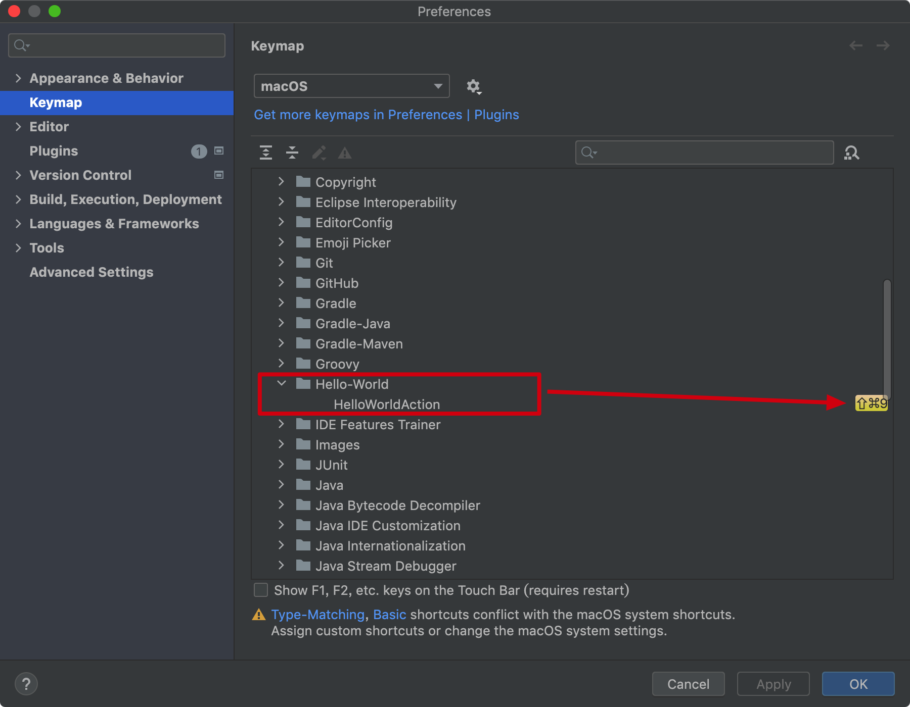

## 源码及文档下载

本教程的所有文档及源码可以关注微信公众号：码农怪兽，在公众号中回复关键字“IDEA插件开发”获取。
