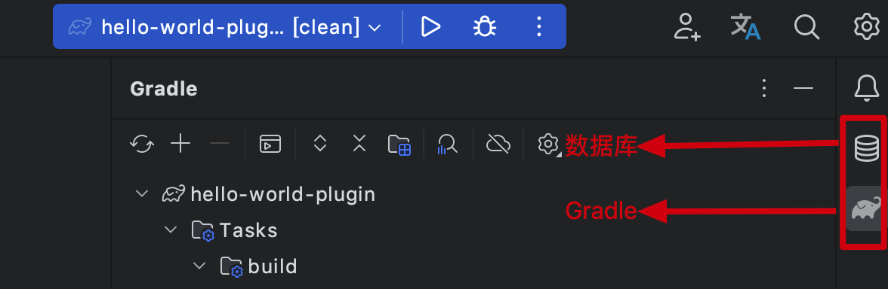
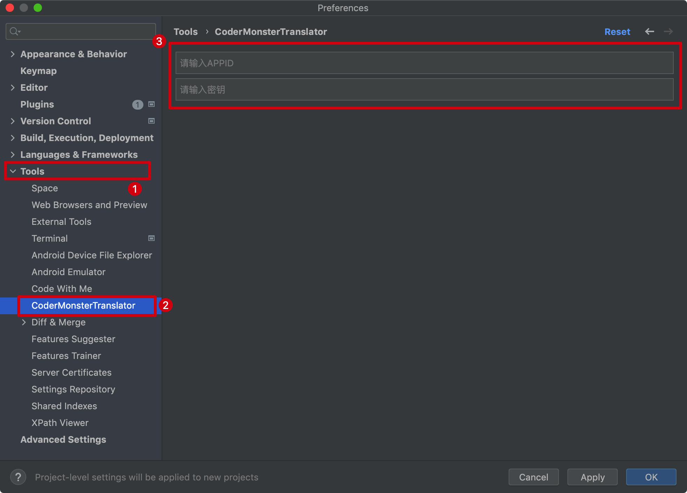
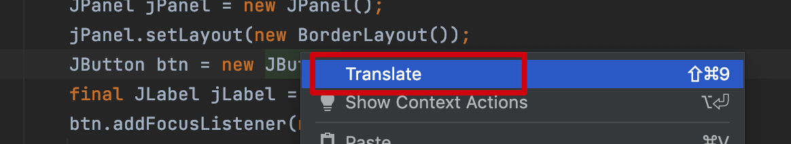
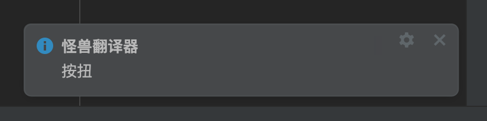
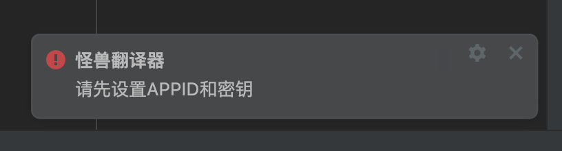
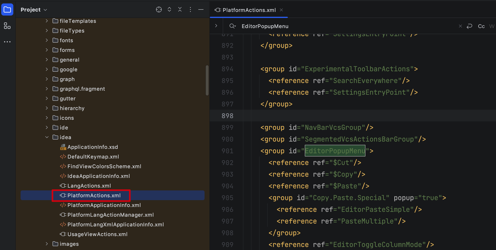

大家好，我是怪兽。

上节我们创建了插件项目，并且通过`Action`给插件项目添加了简单的通知功能，但其实在我们的`IDEA`中，还有一个扩展点的知识也是非常常用的。这节我们通过扩展点开发来使得开发的插件更像`IDE`的原生功能。

## IntelliJ 平台 IDE 拓展点

在`IDEA`中，我们可以经常可以看到侧边栏中有一些工具窗口，工具窗口是 `IDE` 的子窗口，这些窗口通常在主窗口的外边缘，我们称之为工具栏窗口。这些窗口中有按钮、界面，承载了插件的功能点。这种表现形式让插件更加像是 `IDE` 原生功能。



如果没有接触过插件开发的小白可能会认为如果要开发这种类似于`IDE`原生功能的窗口，我们必须要修改`IDE`的源码才可以。其实不然，`IDE`给我们提供了丰富扩展点，通过开发对应的扩展点实现就可以很大程度上扩展模拟出`IDE`很多原生界面功能。由此可以看出`IDE`的源码扩展性是真的强，正因为扩展性强，也吸引了众多开发者积极开发对应平台的插件，在`IDE`竞争中，`IDEA`直接干掉`Eclipse`也变成了意料之内的事，正如现在的`Vscode`，正凭借其强大的插件功能占领编辑器市场，干掉一众老牌的`Sublime Text`、`Notead++`编辑器等，由此可见生态对于一个产品的重要性！

`IntelliJ` 平台把工具窗口实现成了一个“拓展点”，用户在开发的插件代码中，基于拓展点声明窗口的定义，定义包括：窗口的名字、图标等，再通过配置的形式注册到 `IDE` 中，即可看到我们自己的工具窗口。

类似的，在 `Settings/Preferences` 增加一个新的配置选项，也是 `IDE` 中的拓展点之一。点击 `IDE` 中的 `Settings/Preferences` ，我们打开了 `IDE` 的配置界面，这个界面中，可以看到很多配置项，若我们所开发的插件在运行的时候，需要用户先添加一些配置信息，可以基于 `IDE` 的配置拓展点，在`Settings/Preferences` 中实现我们的配置界面。

插件的拓展点让我们的功能更加贴近 `IntelliJ` 平台的能力，`IntelliJ` 平台和 `IDE` 捆绑插件（默认安装的插件）中有 `1000` 多个可用扩展点，今天主要基于上面提到的两个扩展点结合一个翻译的功能需求进行实战。

## 前提要求

在开始之前，我们需要先在[百度翻译开放平台](https://fanyi-api.baidu.com/)注册一个账号，并进行登录，点击管理控制台，获取一下个人翻译`APPID`和密钥。

>百度翻译开放平台：https://fanyi-api.baidu.com/

百度翻译要求接口请求的`QPS<=1`，这也就意味着个人使用免费。

## 项目实战

在开发之前，我们先说一下开发的主流程，其实每一个扩展点都对应着一个接口，我们需要做的就是定义一个实现类实现该接口，然后实现对应方法中的代码逻辑，最后将该实现类注册到插件配置文件中让`IDE`感知到即可。

新建一个项目`traslator`，具体过程不在赘述，创建完成之后，可以简单修改一下`resources/META-INF/plugin.xml`文件：

```xml
<idea-plugin>
    <id>com.codermonster.translator</id>
    <name>Translator</name>
    <vendor email="buaatys@163.com" url="https://codermonster.top/">码农怪兽</vendor>
    <description><![CDATA[
    翻译插件 | 码农怪兽
  ]]></description>
    <depends>com.intellij.modules.platform</depends>
    <extensions defaultExtensionNs="com.intellij">
    </extensions>
</idea-plugin>
```

该文件是插件的配置文件，主要是用来配置`Action`和扩展点，上面的信息任意修改即可，重要的是`Action`和扩展点的声明配置信息。`IntelliJ` 平台提供了配置拓展点，配置拓展点分为项目级别配置和应用级别配置，项目级别配置指的是配置只对当前窗口打开的项目生效，而应用级别配置则是对 `IntelliJ IDE` 应用生效，无论打开多少个项目，应用级别的配置可以在打开的多个项目之间共享。

我们先来开发一下翻译插件的配置扩展点，也就是在偏好设置中的配置`APPID`和密钥的界面，在开发之前，我们需要先在`build.gradle.kts`文件中添加一个依赖：

```kotlin
dependencies {
    // https://mvnrepository.com/artifact/com.alibaba/fastjson
    implementation("com.alibaba:fastjson:2.0.21")
}
```

除此之外，我们在添加几个配置类，这些配置类不需要自己研究，其实现的功能主要是请求百度翻译接口，获得翻译结果。

```java
// 翻译器工具类
public class TranslatorUtils {

    private final static String transAPIHost = "http://api.fanyi.baidu.com/api/trans/vip/translate";
    public static String appid;
    public static String securityKey;

    public static String getTransResult(String query, String from, String to) {
        Map<String, String> params = buildParams(query, from, to);
        String resp = HttpUtils.get(transAPIHost, params);
        TransResp transResp = JSON.parseObject(resp, TransResp.class);
        if (transResp.getTransResult() == null || transResp.getTransResult().size() == 0) {
            return "翻译出错";
        }
        return transResp.getTransResult().get(0).getDst();
    }

    private static Map<String, String> buildParams(String query, String from, String to) {
        Map<String, String> params = new HashMap<String, String>();
        params.put("q", query);
        params.put("from", from);
        params.put("to", to);
        params.put("appid", appid);
        // 随机数
        String salt = String.valueOf(System.currentTimeMillis());
        params.put("salt", salt);
        // 签名
        String src = appid + query + salt + securityKey; // 加密前的原文
        params.put("sign", MD5Utils.md5(src));
        return params;
    }

    public static class TransResp {

        private String from;
        private String to;
        @JsonProperty("trans_result")
        private List<TransResult> transResult;

        public void setFrom(String from) {
            this.from = from;
        }

        public String getFrom() {
            return this.from;
        }

        public void setTo(String to) {
            this.to = to;
        }

        public String getTo() {
            return this.to;
        }

        public void setTransResult(List<TransResult> transResult) {
            this.transResult = transResult;
        }

        public List<TransResult> getTransResult() {
            return this.transResult;
        }
    }

    public static class TransResult {
        private String src;
        private String dst;

        public void setSrc(String src) {
            this.src = src;
        }

        public String getSrc() {
            return this.src;
        }

        public void setDst(String dst) {
            this.dst = dst;
        }

        public String getDst() {
            return this.dst;
        }
    }
}
```

```java
// MD5工具类
public class MD5Utils {

    // 首先初始化一个字符数组，用来存放每个16进制字符
    private static final char[] hexDigits = {'0', '1', '2', '3', '4', '5', '6', '7', '8', '9', 'a', 'b', 'c', 'd', 'e', 'f'};

    /**
     * 获得一个字符串的MD5值
     *
     * @param input 输入的字符串
     * @return 输入字符串的MD5值
     */
    public static String md5(String input) {
        if (input == null) return null;

        try {
            // 拿到一个MD5转换器（如果想要SHA1参数换成”SHA1”）
            MessageDigest messageDigest = MessageDigest.getInstance("MD5");
            // 输入的字符串转换成字节数组
            byte[] inputByteArray = input.getBytes("utf-8");
            // inputByteArray是输入字符串转换得到的字节数组
            messageDigest.update(inputByteArray);
            // 转换并返回结果，也是字节数组，包含16个元素
            byte[] resultByteArray = messageDigest.digest();
            // 字符数组转换成字符串返回
            return byteArrayToHex(resultByteArray);
        } catch (Exception e) {
            return null;
        }
    }

    /**
     * 获取文件的MD5值
     */
    public static String md5(File file) {
        try {
            if (!file.isFile()) {
                System.err.println("文件" + file.getAbsolutePath() + "不存在或者不是文件");
                return null;
            }
            FileInputStream in = new FileInputStream(file);
            String result = md5(in);
            in.close();
            return result;
        } catch (IOException e) {
            e.printStackTrace();
        }

        return null;
    }

    public static String md5(InputStream in) {

        try {
            MessageDigest messagedigest = MessageDigest.getInstance("MD5");
            byte[] buffer = new byte[1024];
            int read = 0;
            while ((read = in.read(buffer)) != -1) {
                messagedigest.update(buffer, 0, read);
            }
            in.close();
            return byteArrayToHex(messagedigest.digest());
        } catch (NoSuchAlgorithmException | IOException e) {
            e.printStackTrace();
        }

        return null;
    }

    private static String byteArrayToHex(byte[] byteArray) {
        // new一个字符数组，这个就是用来组成结果字符串的（解释一下：一个byte是八位二进制，也就是2位十六进制字符（2的8次方等于16的2次方））
        char[] resultCharArray = new char[byteArray.length * 2];
        // 遍历字节数组，通过位运算（位运算效率高），转换成字符放到字符数组中去
        int index = 0;
        for (byte b : byteArray) {
            resultCharArray[index++] = hexDigits[b >>> 4 & 0xf];
            resultCharArray[index++] = hexDigits[b & 0xf];
        }
        // 字符数组组合成字符串返回
        return new String(resultCharArray);

    }
}
```

```java
// HTTP工具类
public class HttpUtils {

    protected static final int SOCKET_TIMEOUT = 10000; // 10S
    protected static final String GET = "GET";

    public static String get(String host, Map<String, String> params) {
        try {
            // 设置SSLContext
            SSLContext sslcontext = SSLContext.getInstance("TLS");
            sslcontext.init(null, new TrustManager[]{myX509TrustManager}, null);

            String sendUrl = getUrlWithQueryString(host, params);

            // System.out.println("URL:" + sendUrl);

            URL uri = new URL(sendUrl); // 创建URL对象
            HttpURLConnection conn = (HttpURLConnection) uri.openConnection();
            if (conn instanceof HttpsURLConnection) {
                ((HttpsURLConnection) conn).setSSLSocketFactory(sslcontext.getSocketFactory());
            }

            conn.setConnectTimeout(SOCKET_TIMEOUT); // 设置相应超时
            conn.setRequestMethod(GET);
            int statusCode = conn.getResponseCode();
            if (statusCode != HttpURLConnection.HTTP_OK) {
                System.out.println("Http错误码：" + statusCode);
            }

            // 读取服务器的数据
            InputStream is = conn.getInputStream();
            BufferedReader br = new BufferedReader(new InputStreamReader(is));
            StringBuilder builder = new StringBuilder();
            String line;
            while ((line = br.readLine()) != null) {
                builder.append(line);
            }

            String text = builder.toString();

            close(br); // 关闭数据流
            close(is); // 关闭数据流
            conn.disconnect(); // 断开连接

            return text;
        } catch (IOException | KeyManagementException | NoSuchAlgorithmException e) {
            e.printStackTrace();
        }

        return null;
    }

    public static String getUrlWithQueryString(String url, Map<String, String> params) {
        if (params == null) {
            return url;
        }

        StringBuilder builder = new StringBuilder(url);
        if (url.contains("?")) {
            builder.append("&");
        } else {
            builder.append("?");
        }

        int i = 0;
        for (String key : params.keySet()) {
            String value = params.get(key);
            if (value == null) { // 过滤空的key
                continue;
            }

            if (i != 0) {
                builder.append('&');
            }

            builder.append(key);
            builder.append('=');
            builder.append(encode(value));

            i++;
        }

        return builder.toString();
    }

    protected static void close(Closeable closeable) {
        if (closeable != null) {
            try {
                closeable.close();
            } catch (IOException e) {
                e.printStackTrace();
            }
        }
    }

    /**
     * 对输入的字符串进行URL编码, 即转换为%20这种形式
     *
     * @param input 原文
     * @return URL编码. 如果编码失败, 则返回原文
     */
    public static String encode(String input) {
        if (input == null) {
            return "";
        }

        return URLEncoder.encode(input, StandardCharsets.UTF_8);
    }

    private static final TrustManager myX509TrustManager = new X509TrustManager() {

        @Override
        public X509Certificate[] getAcceptedIssuers() {
            return null;
        }

        @Override
        public void checkServerTrusted(X509Certificate[] chain, String authType) throws CertificateException {
        }

        @Override
        public void checkClientTrusted(X509Certificate[] chain, String authType) throws CertificateException {
        }
    };
}
```

接下来我们编写翻译插件配置扩展点的实现类`TranslatorSettingConfiguration`，具体代码如下：

```java
public class TranslatorSettingConfiguration implements Configurable {

    private final JComponent component;
    private final JTextField appID;
    private final JTextField securityKey;
    private final static String appIDHint = "请输入APPID";
    private final static String securityKeyHint = "请输入密钥";

    // 构造器，IDE 在初始化我们插件的时候，会实例化拓展点对象，而实例化时只能通过无参构造器创建对象。
    public TranslatorSettingConfiguration() {
        this.component = new JPanel();
        this.component.setLayout(new GridLayout(15, 1));

        // 创建appID、securityKey文本框
        this.appID = new JTextField();
        this.securityKey = new JTextField();

        //设置输入框提示语
        this.appID.setText(appIDHint);
        this.appID.setForeground(JBColor.GRAY);
        this.appID.addFocusListener(new TextFieldListener(this.appID, appIDHint));

        this.securityKey.setText(securityKeyHint);
        this.securityKey.setForeground(JBColor.GRAY);
        this.securityKey.addFocusListener(new TextFieldListener(this.securityKey, securityKeyHint));

        this.component.add(this.appID);
        this.component.add(this.securityKey);
    }


    // 获取配置在 Settings/Preferences 中显示的名字
    @Override
    public @NlsContexts.ConfigurableName String getDisplayName() {
        return "CoderMonsterTranslator";
    }

    // 基于Swing设计配置界面的UI
    @Override
    public @Nullable JComponent createComponent() {
        return component;
    }

    // 提供给 IDE 判断配置是否发生变更，若返回 true，则配置界面中的 apply 按钮可点击
    @Override
    public boolean isModified() {
        return true;
    }

    // 当在配置页面点击 apply 或者 ok 按钮时，该方法会被调用
    @Override
    public void apply() throws ConfigurationException {
        TranslatorUtils.appid = appID.getText();
        TranslatorUtils.securityKey = securityKey.getText();
    }


    static class TextFieldListener implements FocusListener {

        private final String defaultHint;
        private final JTextField textField;

        public TextFieldListener(JTextField textField, String defaultHint) {
            this.defaultHint = defaultHint;
            this.textField = textField;
        }

        // 获得焦点
        @Override
        public void focusGained(FocusEvent e) {
            // 清空提示语，设置为黑色字体
            if (textField.getText().equals(defaultHint)) {
                textField.setText("");
                textField.setForeground(JBColor.BLACK);
            }
        }

        // 失去焦点
        @Override
        public void focusLost(FocusEvent e) {
            // 如果内容为空，设置提示语
            if (textField.getText().equals("")) {
                textField.setText(defaultHint);
                textField.setForeground(JBColor.GRAY);
            }
        }
    }
}
```

然后我们将其注册到`resources/META-INF/plugin.xml`文件中，具体声明如下：

```xml
<extensions defaultExtensionNs="com.intellij">
    <!--                displayName属性和实现类中的展示名应该保持一致-->
    <applicationConfigurable
            parentId="tools"
            instance="com.codermonster.translator.TranslatorSettingConfiguration"
            id="com.codermonster.translator.TranslatorSettingConfiguration"
            displayName="CoderMonsterTranslator"/>
</extensions>
```

可以看到 `extensions` 标签中，添加了一个 `applicationConfigurable` 标签，这表示我们使用了的配置是应用级别的配置。相对应的，`projectConfigurable` 标签表示我们的配置为项目级别配置，这两者的使用方式基本一致。

`applicationConfigurable` 配置标签的主要属性如下：

| 属性          | 属性值                                                       | 解释                                                         |
| ------------- | ------------------------------------------------------------ | ------------------------------------------------------------ |
| `instance`    | 实现了 `Configurable` 接口的类路径                           | 在插件配置被点击时，`IntelliJ` 平台会创建该实例对象。        |
| `id`          | 任意字符串                                                   | 用于描述配置的唯一 `ID` ，不能与其他 `ID` 冲突。             |
| `displayName` | 配置选项的名字                                               | 该名字会显示在 `Settings/Preferences` 中，必须与我们上面代码实现的 `String getDisplayName()` 返回值一致，否则可能出现未知错误。 |
| `parentId`    | 该配置项所属的父级目录，上面的例子中，声明其父级目录为 `tools`。 | `parentId` 支持的属性值有：`appearance`、`build`、`build.tools`、`tools`、`language`、`editor`、`project`，`other`，若我们想把配置项声明为顶级，则配置属性值为 `root` 。 |

至此，我们已经完成了接口实现类的编写，同时也将其注册到了插件配置文件中。接下来，我们可以运行插件，进入 `Settings/Preferences/Tools` ，查看一下当前的效果：



## 编写Action实现划词翻译

通过`TranslatorUtils`代码我们可以知道，当我们填写了`APPID`和密钥之后，点击`Apply`，数据会保存到`TranslatorUtils`的静态变量中，这些数据都是保存在内存中的，只要不关闭当前项目，配置的数据始终都会存在，所以我们接下来获取`TranslatorUtils`中的配置数据，来编写一个`Action`：当我们选中一个词时，通过快捷键或鼠标右键菜单选项，来触发文本翻译功能，并通过消息通知输出到我们的 `IDE` 窗口界面中。

编写`Action`实现类代码如下：

```java
public class TranslatorAction extends AnAction {

    @Override
    public void actionPerformed(@NotNull AnActionEvent e) {
        // 非法判断
        if (TranslatorUtils.appid == null || TranslatorUtils.securityKey == null) {
            Notifications.Bus.notify(new Notification("CoderMonsterTranslator", "怪兽翻译器", "请先设置APPID和密钥", NotificationType.ERROR), e.getProject());
            return;
        }
        Editor editor = e.getData(CommonDataKeys.EDITOR);
        String text = editor.getSelectionModel().getSelectedText();
        String transResult = TranslatorUtils.getTransResult(text, "auto", "zh");
        Notifications.Bus.notify(new Notification("CoderMonsterTranslator", "怪兽翻译器", transResult, NotificationType.INFORMATION), e.getProject());
    }
}
```

将实现类注册到插件配置文件中，具体代码如下：

```xml
<actions>
    <action id="translator" class="com.codermonster.translator.TranslatorAction" description="Translate"
            text="Translate">
        <!-- 绑定快捷键，此处也可以选择不绑定 -->
        <keyboard-shortcut first-keystroke="control shift 9" keymap="$default"/>
        <!-- 添加到鼠标右键菜单中 -->
        <add-to-group group-id="EditorPopupMenu" anchor="first"/>
    </action>
</actions>
```

此时运行项目，首先配置百度翻译开放接口的`APPID`和密钥，然后随便打开一个项目划词翻译（右键触发或者快捷键触发）：



可以得到如下的结果通知：



如果没有配置`APPID`和密钥，直接进行翻译会导致如下的消息通知：



若是想把 `Action` 添加到其他菜单，只需修改 `add-to-group` 标签的 `group-id` 属性值，全局搜索 `PlatformActions.xml` 文件，打开该文件，文件中定义了大部分的菜单 `group-id` 值。



## 学习资源

上面的代码演示了配置扩展点的实现及注册，同时也对`Action`的实现和注册做了实现，唯一存在难点的可能是`Swing`的使用，不过这不是本课程的重点，如果有学习`Swing`的需要可以参考如下网址：

https://www.javatpoint.com/java-swing

## 源码及文档下载

本教程的所有文档及源码可以关注微信公众号：码农怪兽，在公众号中回复关键字“IDEA插件开发”获取。
