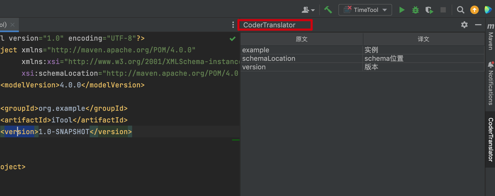

大家好，我是怪兽。

上节内容我们通过配置扩展点，完成了翻译插件的`APPID`和密钥的配置功能，并且通过实现的`Action`可以达到划词翻译效果，但是该实现还是存在一个问题，就是`APPID`和密钥是存储在静态变量之中的，也就是在内存中，每当重启`IDEA`之后，都需要重新配置`APPID`和密钥才可以继续使用翻译功能。今天我们来解决一下配置数据持久化的问题。

## 持久化配置数据

`IntelliJ` 平台的数据持久化是将对象数据序列化后存储数据到本地文件，序列化协议采用的是 `XML` 。当 `IDE` 在重启时，会将`XML`文件内容反序列化为对象，以供插件使用。持久化配置数据也是一个扩展点，其接口对应于`PersistentStateComponent<T>`，该接口接收一个需要持久化的数据泛型类型。

首先定义一个需要持久化数据的泛型类，定义名称为：`TranslatorSetting`，具体代码如下：

```java
@State(name = "translator", storages = {@Storage(value = "translator.xml")})
public class TranslatorSetting implements PersistentStateComponent<TranslatorSetting> {


    public static TranslatorSetting getInstance() {
        return ApplicationManager.getApplication().getService(TranslatorSetting.class);
    }

    public String appID;
    public String securityKey;

    // IDE获取状态数据，即配置数据，通过XML序列化实现持久化过程
    // 点击OK的时候会执行
    @Override
    public @Nullable TranslatorSetting getState() {
        // 设置完APPID和密钥之后，使其可以直接使用，否则只能重启才可以使用
        TranslatorUtils.appid = this.appID;
        TranslatorUtils.securityKey = this.securityKey;
        return this;
    }

    // IDE重启的时候通过XML反序列化实现加载配置数据的过程
    @Override
    public void loadState(@NotNull TranslatorSetting state) {
        this.appID = state.appID;
        this.securityKey = state.securityKey;
    }
}

```

1、`getState`方法是将配置数据进行持久化，持久化过程是通过`XML`序列化实现的，具体的序列化过程`IDE`直接都帮忙完成了，程序员不必关心。

2、`loadState`方法用于加载已经序列化的`XML`文件，将其反序列化为对象供程序员使用，具体的反序列化过程`IDE`直接都帮忙完成了，程序员不必关心。

3、两者的调用时机：`loadState()` 方法，在插件被加载时会被调用，`IDE` 将数据反序列化为对象，作为方法的入参数；而 `getState()` 方法在每次修改数据被保存时都会调用，该方法返回配置对象，以 `XML` 协议序列化后存储到文件中。

4、`State` 注解可以对持久化文件的属性进行配置，例如 `storages` 字段指定了存储文件名字。

5、`getInstance()` 方法是程序员自己包装的，用于获取 `IDE` 中给我们反序列化后的持久化对象。

6、配置可以分为项目级别和应用级别，如果是项目级别，获取持久化对象的方式略有不同。具体的实现代码如下：

```java
public static TranslatorSetting getInstance(Project project) {
    return project.getService(TranslatorSetting.class);
}
```

其中，方法的入参为 `Project` 对象，`Project` 对象获取方式有很多种。

通过上面的代码完成了配置数据持久化实现类的编写，现在我们需要修改一下翻译插件配置扩展点实现类`TranslatorSettingConfiguration`的代码：

```java
public class TranslatorSettingConfiguration implements Configurable {


    // 构造器，IDE 在初始化我们插件的时候，会实例化拓展点对象，而实例化时只能通过无参构造器创建对象。
    public TranslatorSettingConfiguration() {

        // 持久化的数据是否已经存在
        if (TranslatorSetting.getInstance().appID != null) {//存在
            this.appID.setText(TranslatorSetting.getInstance().appID);
        } else {// 不存在
            this.appID.setText(appIDHint);
            this.appID.setForeground(JBColor.GRAY);
        }
        this.appID.addFocusListener(new TextFieldListener(this.appID, appIDHint));

        if (TranslatorSetting.getInstance().securityKey != null) {
            this.securityKey.setText(TranslatorSetting.getInstance().securityKey);
        } else {
            this.securityKey.setText(securityKeyHint);
            this.securityKey.setForeground(JBColor.GRAY);
        }
        this.securityKey.addFocusListener(new TextFieldListener(this.securityKey, securityKeyHint));

    }


    // 当在配置页面点击 apply 或者 ok 按钮时，该方法会被调用
    @Override
    public void apply() throws ConfigurationException {
        // 点击 apply 的时候 会被调用
        TranslatorSetting.getInstance().appID = appID.getText();
        TranslatorSetting.getInstance().securityKey = securityKey.getText();
    }


}

```

修改`TranslatorUtils`工具类，使其从反序列化的配置对象中获取数据：

```java
public class TranslatorUtils {
  // 获取数据
    public static String appid = TranslatorSetting.getInstance().appID;
    public static String securityKey = TranslatorSetting.getInstance().securityKey;
}
```

将持久化数据扩展点的实现类注册到插件配置文件中：

```xml
<extensions defaultExtensionNs="com.intellij">
    <!--        注册持久化实现类-->
    <applicationService serviceImplementation="com.codermonster.translator.TranslatorSetting"></applicationService>
</extensions>
```

其中，`applicationService` 标签表示持久化配置是服务于应用级别，若想每个项目都使用独立的配置，则使用 `projectService` 标签。

我们启动插件，对插件的 `APPID` 和密钥进行一次配置后，可以使用翻译插件的功能，同时关闭`IDEA`之后，重新在开启`IDEA`新窗口，不需要配置`APPID`和密钥即可使用，这是因为`TranslatorSettingConfiguration`在创建实例的时候，已经从持久化的`XML`文件中读取了相应的配置信息，由此可见翻译插件的配置信息已经被持久化保存了，但是保存在哪里呢？具体路径如下图所示：


可见，代码中程序员只需要关心对字段进行赋值即可，`IntelliJ` 平台 `SDK` 会帮我们处理数据持久化，即自动完成序列化和反序列化过程。但是需要注意在对象中只有以下类型可以被原生的支持持久化，分别是：`Number` 、`Boolean` 、`String` 、`Collection` 、`Map` 、`Enum`，若是我们定义了其他类型的字段，我们需要告诉 `IDE` 如何进行序列化以及反序列化。

## 缓存翻译的结果

使用持久化扩展点，我们可以对翻译结果缓存，在查询的时候，先去查询缓存，如果命中，则直接返回缓存中的结果；否则会通过请求接口来获得翻译结果，并将其存入缓存，展示给用户。这样做的好处就是当翻译同一个单词时，复用历史翻译结果，可加快翻译速度，减少对 `API` 的调用。

具体代码如下：

```java
@State(name = "translator.cache", storages = {@Storage(value = "translator-cache.xml")})
public class TranslatorCache implements PersistentStateComponent<TranslatorCache> {

    public Map<String, String> cacheMap = new LinkedHashMap<>();

    // 获取反序列化后的结果-项目级别
    public static TranslatorCache getInstance(Project project) {
        return project.getService(TranslatorCache.class);
    }

    @Override
    public @Nullable TranslatorCache getState() {
        return this;
    }

    @Override
    public void loadState(@NotNull TranslatorCache state) {
        if (state == null) {
            return;
        }
        // 拿到反序列化后的对象数据
        this.cacheMap = state.cacheMap;
    }
}

```

我们使用 `Map` 类型的字段保存翻译数据，`key` 是翻译的原文，`value` 则是对应的翻译结果。最后，注册拓展点到 `plugin.xml` 中，这里使用项目级别持久化标签 `projectService`，表示每个不同项目之间，翻译缓存是相互独立的。

```xml
<extensions defaultExtensionNs="com.intellij">
    <projectService serviceImplementation="com.codermonster.translator.TranslatorCache"></projectService>
</extensions>
```

修改 `TranslatorAction` 逻辑，每次翻译时优先查询缓存，查不到时再调用翻译 `API` ，并将结果缓存到 `TranslatorCache` 中。

```java
public class TranslatorAction extends AnAction {

    @Override
    public void actionPerformed(@NotNull AnActionEvent e) {
        // 非法判断
        if (TranslatorUtils.appid == null || TranslatorUtils.securityKey == null) {
            Notifications.Bus.notify(new Notification("CoderMonsterTranslator", "怪兽翻译器", "请先设置APPID和密钥", NotificationType.ERROR), e.getProject());
            return;
        }

        // 获得翻译缓存数据
        Map<String, String> cacheMap = TranslatorCache.getInstance(e.getProject()).cacheMap;

        Editor editor = e.getData(CommonDataKeys.EDITOR);
        String text = editor.getSelectionModel().getSelectedText();

        String transResult = null;
        // 查询缓存
        if (cacheMap.containsKey(text)) {
            transResult = cacheMap.get(text);
        } else {
            // 通过API接口进行翻译
            transResult = TranslatorUtils.getTransResult(text, "auto", "zh");
            // 将结果进行缓存
            cacheMap.put(text, transResult);
        }

        Notifications.Bus.notify(new Notification("CoderMonsterTranslator", "怪兽翻译器", transResult, NotificationType.INFORMATION), e.getProject());
    }
}
```

项目级别的数据持久化，持久化文件会被保存在每个项目下的 `.idea` 目录，该文件在项目级别独享，以下是翻译插件的持久化数据文件，每次关闭项目的时候，数据会被保存到缓存文件中，下次打开就可以看到缓存的翻译内容。


## 原生工具栏翻译

工具栏拓展点可将我们的插件在工具栏窗口进行展示，使其就像原生的`IDEA`窗口，在此处，我们可以将翻译结果在侧边工具栏窗口进行展示，实现以下视图效果，方便查阅历史翻译结果。



工具栏窗口拓展点接口为 `com.intellij.openapi.wm.ToolWindowFactory` ，我们实现该接口的 `createToolWindowContent` 方法，`IDE` 在启动插件时，会回调方法创建工具栏窗口的视图。我们需要在该方法中创建窗口视图。

```java
public class TranslatorToolsWindow implements ToolWindowFactory {

    private static JTable table;

    // 创建工具栏视图
    @Override
    public void createToolWindowContent(@NotNull Project project, @NotNull ToolWindow toolWindow) {
        // ContentFactory 在 IntelliJ 平台 SDK 中负责 UI 界面的管理
        ContentFactory contentFactory = ContentFactory.SERVICE.getInstance();
        // 创建我们的工具栏界面，TranslatorNote 是基于 Swing 实现的一个窗口视图
        TranslatorNote note = new TranslatorNote();
        table = note.getTable();
        // 在界面工厂中创建翻译插件的界面
        Content content = contentFactory.createContent(note.getNotePanel(), "", false);
        // 将被界面工厂代理后创建的content，添加到工具栏窗口管理器中
        toolWindow.getContentManager().addContent(content);
    }


    // 基于 Swing 实现的窗口类
    static class TranslatorNote {
        // Swing 中的滑动窗口视图
        private final JScrollPane notePanel;
        // Swing 中的表格视图，该表格视图用于展示翻译结果
        private final JTable table;

        public TranslatorNote() {
            // 设置表格的表头
            String[] header = {"原文", "译文"};
            DefaultTableModel tableModel = new DefaultTableModel(null, header);
            this.table = new JTable();
            this.table.setAutoResizeMode(JTable.AUTO_RESIZE_SUBSEQUENT_COLUMNS);
            this.table.setModel(tableModel);
            this.notePanel = new JBScrollPane(table);
            this.notePanel.setSize(200, 800);
        }

        public JScrollPane getNotePanel() {
            return notePanel;
        }

        public JTable getTable() {
            return table;
        }
    }

    // addNote 方法将翻译插件的原文与译文加入到工具栏窗口的表格视图中
    public static void addNote(String from, String to) {
        if (table == null) {
            return;
        }
        DefaultTableModel tableModel = (DefaultTableModel) table.getModel();
        tableModel.addRow(new Object[]{from, to});
    }

    // 获取table
    public static JTable getTable() {
        return table;
    }
}
```

将其注册到插件配置文件中，具体如下：

```xml
<extensions defaultExtensionNs="com.intellij">
    <toolWindow id="CoderTranslator" anchor="right"
                factoryClass="com.codermonster.translator.TranslatorToolsWindow"/>
</extensions>
```

工具栏窗口扩展点属性中所需配置的属性有：`id`、`anchor`、`icon`、`secondary`，此处我们关注 `anchor`、`factoryClass` 属性。`anchor` 属性决定了我们的工具栏窗口在 `IDE` 的显示位置，可选值有：`left（default）`、`right`、`bottom`，其中，如果不配置 `anchor` 属性，`left` 则是默认的位置。`factoryClass` 属性指定了工具栏窗口拓展点实现类的类路径。

最后，在翻译 `Action` 中，每次翻译都将结果显示到工具栏窗口中，此处还应该注意，如果是多次翻译一个内容，则不应该重复添加，具体代码如下：

```java
public class TranslatorAction extends AnAction {

    @Override
    public void actionPerformed(@NotNull AnActionEvent e) {

        // 在工具栏窗口中显示-去重
        JTable table = TranslatorToolsWindow.getTable();
        int rowCount = table.getModel().getRowCount();
//        System.out.println(rowCount);
        for (int i = 0; i < rowCount; i++) {
            String value = (String) table.getModel().getValueAt(i, 0);
  //          System.out.println(value);
          // 如果已经窗口中已经存在，不需要在重复添加
            if (text.equals(value)) {
                return;
            }
        }
      // 添加翻译结果到窗口中
        TranslatorToolsWindow.addNote(text, transResult);
    }
}
```

具体效果如下：


## 总结所用扩展点

总结一下用到的扩展点和`Action`：

1、持久化扩展点（接口）：`com.intellij.openapi.components.PersistentStateComponent<T>` 

2、配置界面扩展点（接口）：`com.intellij.openapi.options.Configurable`

3、原生界面侧边栏扩展点（接口）：`com.intellij.openapi.wm.ToolWindowFactory`

4、功能`Action`（抽象类）：`com.intellij.openapi.actionSystem.AnAction`

各个扩展点和`Action`的注册如下：

```xml
<idea-plugin>
    <extensions defaultExtensionNs="com.intellij">
        <!--                displayName属性和实现类中的展示名应该保持一致-->
      <!-- 配置界面扩展点 -->
        <applicationConfigurable
                parentId="tools"
                instance="com.codermonster.translator.TranslatorSettingConfiguration"
                id="com.codermonster.translator.TranslatorSettingConfiguration"
                displayName="CoderMonsterTranslator"/>
        <!--        持久化扩展点-->
        <applicationService serviceImplementation="com.codermonster.translator.TranslatorSetting"></applicationService>
        <!--        持久化扩展点-->
      <projectService serviceImplementation="com.codermonster.translator.TranslatorCache"></projectService>
        <!--        侧边栏扩展点-->
      <toolWindow id="CoderTranslator" anchor="right"
                    factoryClass="com.codermonster.translator.TranslatorToolsWindow"/>
    </extensions>

    <actions>
      <!-- 功能Action注册 -->
        <action id="translator" class="com.codermonster.translator.TranslatorAction" description="Translate"
                text="Translate">
            <!-- 绑定快捷键，此处也可以选择不绑定 -->
            <keyboard-shortcut first-keystroke="control shift 9" keymap="$default"/>
            <!-- 添加到鼠标右键菜单中 -->
            <add-to-group group-id="EditorPopupMenu" anchor="first"/>
        </action>
    </actions>
</idea-plugin>
```

## 源码及文档下载

本教程的所有文档及源码可以关注微信公众号：码农怪兽，在公众号中回复关键字“IDEA插件开发”获取。
