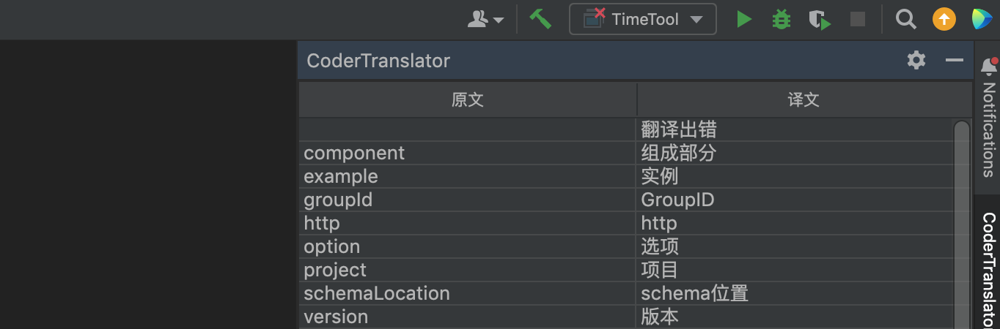
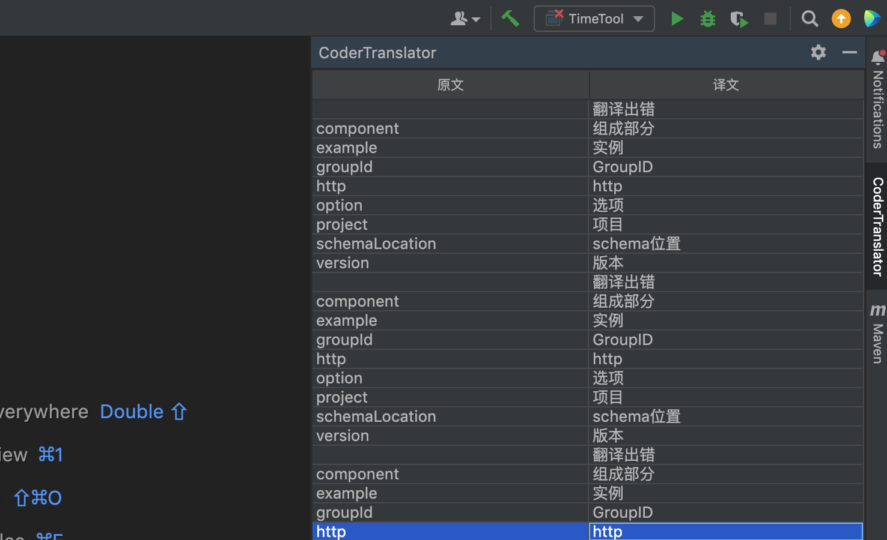
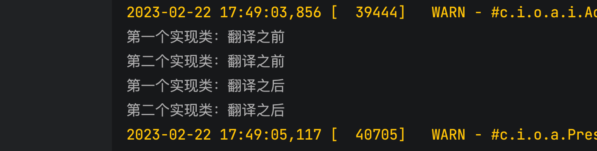
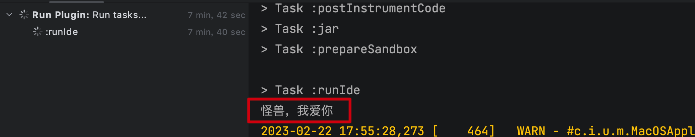

大家好，我是怪兽。

今天我们来学习一下`IDEA`插件开发中的事件监听机制，听名字感觉非常的高大上，其实就是特定事件点的回调函数，比如 `IDE` 应用启动事件、`IDE` 应用关闭事件、项目打开事件、项目关闭事件、文件编辑事件，这些都对应一些回调函数，如果我们想要在特定事件点执行一些我们想要的功能，只需要重写方法的功能逻辑即可。今天我们来简单看一下事件监听机制。

## 项目监听器

项目监听器可监听一个项目从被打开到被关闭之间生命周期内的事件，分别是以下 `4` 个阶段：项目打开完成时、项目关闭完成时、项目关闭前、项目关闭且在文件保存前（项目关闭时，`IDE` 会保存文件）。项目监听器对应接口为`com.intellij.openapi.project.ProjectManagerListener`，该接口中的定义了 `4` 个抽象方法，在不同的时刻会被调用，以下是方法与事件触发时刻对照表：

| 方法                         | 触发时机               |
| ---------------------------- | ---------------------- |
| `projectOpened()`            | 项目打开完成时         |
| `projectClosed()`            | 项目关闭完成时         |
| `projectClosing()`           | 项目关闭前             |
| `projectClosingBeforeSave()` | 项目关闭且在文件保存前 |

现在有一个需求：在项目打开完成时，检查翻译插件是否配置了`APPID`和密钥，如果没有配置，那么提醒用户去配置。

监听器的具体代码如下：

```java
public class TranslatorSettingListener implements ProjectManagerListener {


    @Override
    public void projectOpened(@NotNull Project project) {
//        System.out.println("-----");

        if (TranslatorSetting.getInstance().appID == null && TranslatorSetting.getInstance().securityKey == null) {// 没有配置APPID和密钥
            // 提示进行配置
            Notification notification = new Notification("怪兽翻译器", "请配置APPID和密钥", NotificationType.WARNING);
            // 在提示消息中，增加一个 Action，可以通过 Action 一步打开配置界面
            notification.addAction(new OpenTranslatorSettingAction());
            // 发送通知
            Notifications.Bus.notify(notification, project);
        }
    }


    static class OpenTranslatorSettingAction extends NotificationAction {

        OpenTranslatorSettingAction() {
            super("打开翻译插件配置界面");
        }

        @Override
        public void actionPerformed(@NotNull AnActionEvent e, @NotNull Notification notification) {
            // IntelliJ SDK 提供的一个工具类，可以通过配置项名字，直接显示对应的配置界面
            ShowSettingsUtil.getInstance().showSettingsDialog(e.getProject(), "CoderMonsterTranslator");
            notification.expire();
        }
    }
}

```

消息通知代码中，我们第一次使用到消息通知 `Action`，在消息通知中绑定了一个 `NotificationAction` 实现类，`NotificationAction` 与我们前面接受过的 `Action` 概念类似，只是表现形式不同。此处实现的逻辑是用户可以通过点击消息通知中的高亮文字，触发 `Action`。`Action` 使用到 `ShowSettingsUtil` 工具，`ShowSettingsUtil` 类是由 `IntelliJ SDK` 提供的一个打开配置界面的工具类，在需要快捷打开配置界面的场景中经常会用到。

然后我们将监听器实现类注册到插件配置文件中：

```xml
<projectListeners>
    <listener class="com.codermonster.translator.TranslatorSettingListener"
              topic="com.intellij.openapi.project.ProjectManagerListener"/>
</projectListeners>
```

因为是一个项目级别的监听器，因此对应的配置标签是 `projectListeners` ，该标签中的 `class` 属性值是我们的监听器实现类，而 `topic` 是监听事件类型对应的监听接口。

运行插件项目，在新的`IDEA`窗口中随便打卡一个项目，然后可以得到如下的通知结果：


## 工具栏窗口监听器

翻译插件已经实现了工具栏窗口记录每次的翻译历史，而且也进行了去重，对于重复的原文内容翻译，不会重复添加，但是有一个问题：每次重启应用后，工具栏窗口渲染的翻译历史记录都会被清空，我们希望打开插件窗口后，把历史的翻译记录渲染到工具栏窗口中。

工具栏窗口监听器可以监听插件注册事件、插件移除注册事件、插件界面被打开事件。

工具栏窗口监听器的接口为 `com.intellij.openapi.wm.ex.ToolWindowManagerListener` ，该接口中主要关注以下方法与事件触发时刻：

| 方法                     | 触发时机                                                     |
| ------------------------ | ------------------------------------------------------------ |
| `toolWindowRegistered`   | 插件窗口首次启动被注册到 `IDE` 中时，因为只注册一次，因此该方法在 `IDE` 启动后只会被调用一次 |
| `toolWindowUnregistered` | 插件窗口被移除注册时，例如我们在 `IDE` 配置界面禁用了插件    |
| `toolWindowShown`        | 插件工具栏窗口每次被点击打开时，都会被调用                   |

具体代码如下：

```java
public class InitTranslatorWindowListener implements ToolWindowManagerListener {
    private final Project project;

    public InitTranslatorWindowListener(Project project) {
        this.project = project;
    }

    // 工具栏窗口被打开展示的时候
    @Override
    public void toolWindowShown(@NotNull ToolWindow toolWindow) {
        if (!toolWindow.getId().equals("CoderTranslator")) {
            return;
        }
        // 确定打开的时CoderTranslator窗口
        TranslatorCache.getInstance(project).cacheMap.forEach((s, s2) -> TranslatorToolsWindow.addNote(s, s2));
    }
}
```

将其注册到插件配置文件中：

```xml
<projectListeners>
    <listener class="com.codermonster.translator.InitTranslatorWindowListener"
              topic="com.intellij.openapi.wm.ex.ToolWindowManagerListener"/>
</projectListeners>
```

声明了一个带有 `Project` 单参数的构造器，我们的监听器对象由 `IDE` 创建，`IDE` 在创建该对象时调用构造方法，会传入当前项目所对应的 `Project` 对象，提供 `Project` 参数供我们使用。当然，若是我们的代码逻辑不需要此参数，可以传入 `Project` 参数，使用默认构造器即可。

运行插件项目，点击翻译插件的工具栏窗口，此时会同步缓存的翻译内容：



但是，现在会出现一个问题就是，每次点击该工具栏窗口都会添加缓存的翻译数据，该如何解决呢？在首次注册的时候，只需要同步一次缓存数据即可。



```java
public class InitTranslatorWindowListener implements ToolWindowManagerListener {
    private final Project project;

    public InitTranslatorWindowListener(Project project) {
        this.project = project;
    }
  // 首次打开的时候进行注册，在注册的时候同步一次数据即可
    @Override
    public void toolWindowsRegistered(@NotNull List<String> ids, @NotNull ToolWindowManager toolWindowManager) {
        if (ids.contains("CoderTranslator")) {
            TranslatorCache.getInstance(project).cacheMap.forEach((s, s2) -> TranslatorToolsWindow.addNote(s, s2));
        }
    }
}
```

## 自定义事件

所谓的自定义事件就是类似于项目监听器、工具栏窗口监听器一样，我们可以为翻译插件也自定义一些事件，比如翻译前和翻译后。

举个具体的例子，如果我们希望翻译插件在翻译前和翻译后，通知所有的订阅者，应该怎么做呢？

我们可以做一个翻译监听器，下面以此为例，介绍一下`IDEA`插件开发中的自定义事件。

首先我们知道监听器是一个顶层接口，在这个接口中需要定义各个事件下的回调函数，接口中不必实现，除此之外，我们还应该在监听器中确定监听的主题`Topic`，具体代码如下：

```java
public interface TranslatorManagerListener extends EventListener {
    // 定义 topic
    Topic<TranslatorManagerListener> TRANSLATE_TOPIC = Topic.create("translator", TranslatorManagerListener.class);
    // 翻译之前
    default void beforeTranslated(Project project) {
    }
    // 翻译之后
    default void afterTranslated(Project project) {
    }
}
```

监听的`Topic`表明当收到哪一个 `Topic` 时，触发翻译监听器。

在翻译监听器接口中，调用了 `com.intellij.util.messages.Topic` 类的静态方法，创建了一个 `Topic` ，`Topic` 名为 `translator` ，订阅者的实现类是 `TranslatorManagerListener` 类型的。

然后我们需要在`TranslatorAction`中修改代码，使其在划词翻译的前后两个事件点，发送消息给所有的订阅者，具体代码如下：

```java
public class TranslatorAction extends AnAction {

    @Override
    public void actionPerformed(@NotNull AnActionEvent e) {
        MessageBus messageBus = e.getProject().getMessageBus();
        TranslatorManagerListener publisher = messageBus.syncPublisher(TranslatorManagerListener.TRANSLATE_TOPIC);
        // 翻译之前
        publisher.beforeTranslated(e.getProject());
        // 翻译过程
        // ---省略---
        // 翻译之后
        publisher.afterTranslated(e.getProject());
    }
}

```

实现翻译监听器：

```java
public class TranslatorListenerImpl1 implements TranslatorManagerListener {
    @Override
    public void beforeTranslated(Project project) {
        System.out.println("第一个实现类：翻译之前");
    }

    @Override
    public void afterTranslated(Project project) {
        System.out.println("第一个实现类：翻译之后");
    }
}

public class TranslatorListenerImpl2 implements TranslatorManagerListener {

    @Override
    public void beforeTranslated(Project project) {
        System.out.println("第二个实现类：翻译之前");
    }

    @Override
    public void afterTranslated(Project project) {
        System.out.println("第二个实现类：翻译之后");
    }
}
```

注册监听器：

```xml
<projectListeners>
    <listener class="com.codermonster.translator.TranslatorListenerImpl1"
              topic="com.codermonster.translator.TranslatorManagerListener"/>

    <listener class="com.codermonster.translator.TranslatorListenerImpl2"
              topic="com.codermonster.translator.TranslatorManagerListener"/>
</projectListeners>
```

运行插件项目，随便打开一个项目进行划词翻译，可以得到如下的运行结果：



至此，我们已经学习完`IDEA`中的事件监听，也可以为自己开发的插件创造监听器，提高插件的扩展性。

## 应用监听器

上面的内容只涉及到了项目监听器，下面举一个应用监听器的案例，其需求就是在应用打开的时候，在控制台打印一句话：“怪兽，我爱你！”。

```java
public class ApplicationListener implements AppLifecycleListener {
    @Override
    public void appStarted() {
        System.out.println("怪兽，我爱你");
    }
}
```

将应用监听器实现类注册到插件配置文件中：

```xml
<applicationListeners>
    <listener class="com.codermonster.translator.ApplicationListener"
              topic="com.intellij.ide.AppLifecycleListener"></listener>
</applicationListeners>
```

运行插件项目，得到如下的运行结果：



总结一下：应用监听器注册标签是`applicationListeners`，应用监听器接口是`com.intellij.ide.AppLifecycleListener`。

## 源码及文档下载

本教程的所有文档及源码可以关注微信公众号：码农怪兽，在公众号中回复关键字“IDEA插件开发”获取。